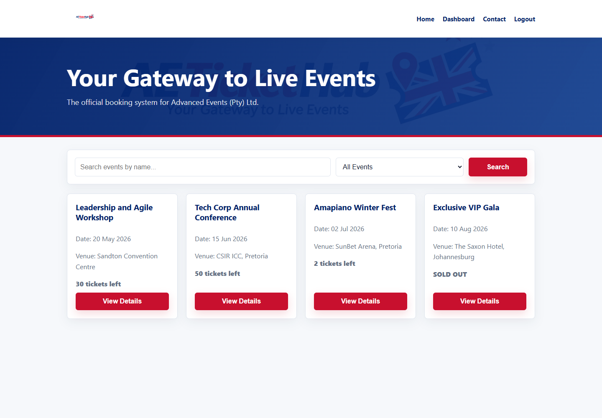

# AETicketHub

Smart Event Management and Ticketing Platform for Advanced Events (Pty) Ltd.

AETicketHub is a Node.js and Express web application for event discovery,
secure authentication, ticket booking, admin event management, dashboards, and
contact enquiry management.

----



## Features

- Event listings with search and filtering.
- User registration and login.
- Role-based access for standard users and admins.
- Admin event create, read, update, and delete workflows.
- Ticket booking with capacity validation.
- User booking history and admin analytics.
- Contact enquiry submission and management.
- MongoDB persistence through Mongoose models.

## Technologies Used

- Node.js
- Express.js
- MongoDB
- Mongoose
- JSON Web Tokens
- bcrypt password hashing
- EJS
- HTML5
- CSS3
- JavaScript

## Team Members and Roles

| Student            | Student Number | Role                                                 |
| ------------------ | -------------- | ---------------------------------------------------- |
| Ethan Ogle         | 602114         | Debugging, assignment alignment, final QA            |
| Jaden Van der Lely | 600690         | GitHub repository, authentication, security          |
| Aphiwe Shabalala   | 602517         | MongoDB, Mongoose models, database integration       |
| Nokwanda Legoabe   | 578051         | Frontend, EJS pages, routing UI                      |
| Agobakwe Sedikwe   | 576505         | Express backend, controllers, routes, business logic |

## Setup Instructions

1. Install Node.js.
2. Install MongoDB Community Edition from https://www.mongodb.com/products/self-managed/community-edition and start MongoDB locally.
3. Install project dependencies:

```bash
npm install
```

4. Rename `.env.example` to `.env`, then update the values:

```env
JWT_SECRET=replace-this-with-a-secure-secret
```

5. Start the server:

```bash
npm start
```

6. Open the application:

```text
http://localhost:5000
```

The current database connection is configured in `config/db.js`.

## Demo Admin Login

The server creates a predefined admin account on startup:

```text
Email: admin@aetickethub.local
Password: Admin123!
```

Use this account on `/login` to access the admin dashboard.

## JWT Command Notes

Generate a strong JWT secret for the `.env` file:

```bash
node -e "console.log(require('crypto').randomBytes(32).toString('hex'))"
```

Save the generated value like this:

```env
JWT_SECRET=paste-generated-secret-here
```

## Demo Flow

1. Start MongoDB and the Express server.
2. Open the home/event listing page.
3. Demonstrate event search and filtering.
4. Register a standard user.
5. Log in and access the protected dashboard.
6. Book tickets and show capacity validation.
7. Show user booking history.
8. Log in as an admin.
9. Create, update, and delete an event.
10. Show admin analytics.
11. Submit a contact enquiry.
12. Show admin enquiry management.
